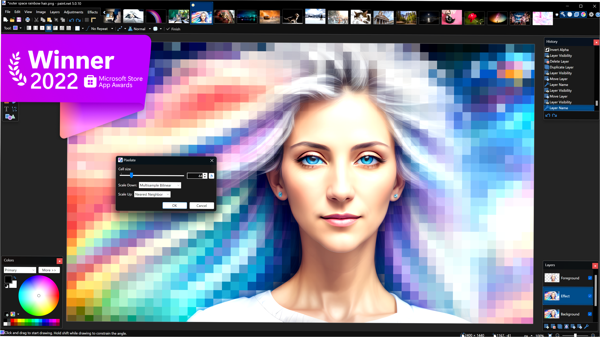

# The official page for installing Paint.NET 
**Paint.NET** is free image editing software for Windows, offering layers, effects, and essential tools. It's easy to use, suitable for beginners and advanced users alike, and perfect for tasks from simple edits to complex designs. Plugin support allows for extended functionality.

## To download Paint.NET from GitHub, simply follow these steps:

**1.** Click the download button on the Paint.NET GitHub page.

**2.** After clicking the button, you’ll see the download start in the top-right corner of your browser.

**3.** Once the download is complete, open the file to install Paint.NET on your computer.

**4.** Once installed, you'll be able to work with your images with ease!

### Why Choose Paint.NET

1. ⭐️**Free** – Paint.NET provides professional image editing tools at no cost.
2. ⭐️**Ease of Use** – The intuitive interface makes it accessible for everyone, from beginners to professionals.
3. ⭐️**Layer Support** – Work with multiple layers, ideal for complex graphic projects.
4. ⭐️**High Performance** – Optimized for speed, even when handling large images.
5. ⭐️**Extensibility** – Plugin support allows for adding new features and enhancing functionality.

